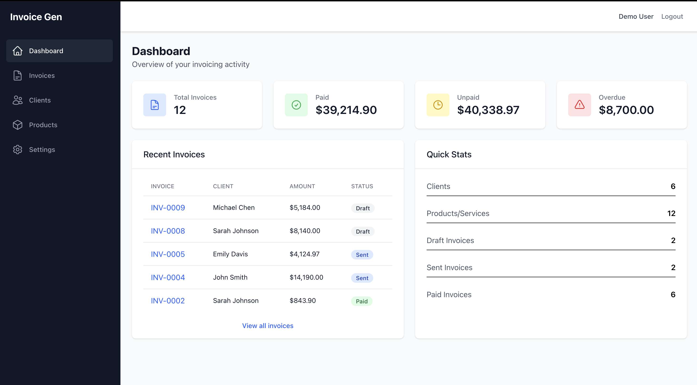
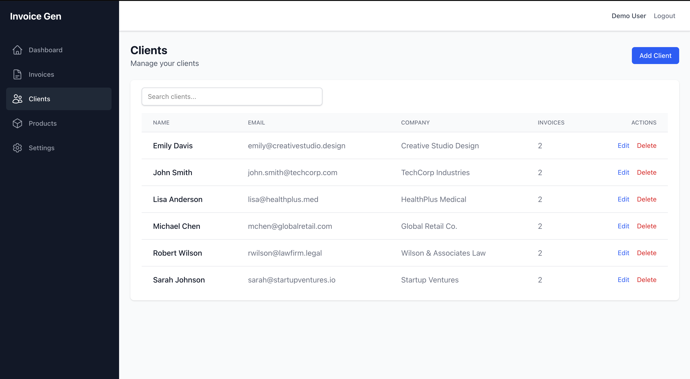
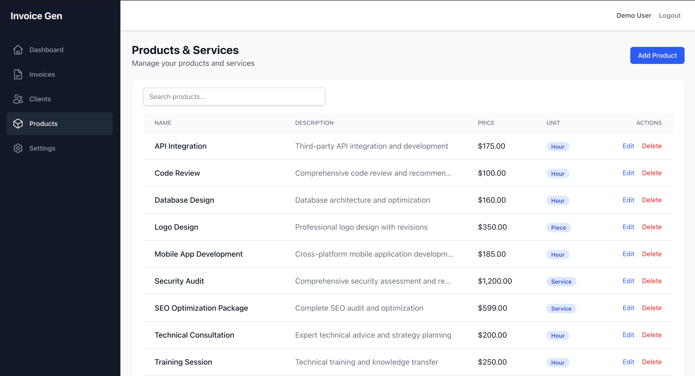
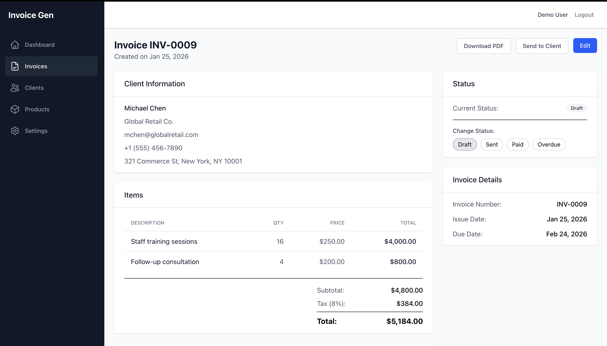
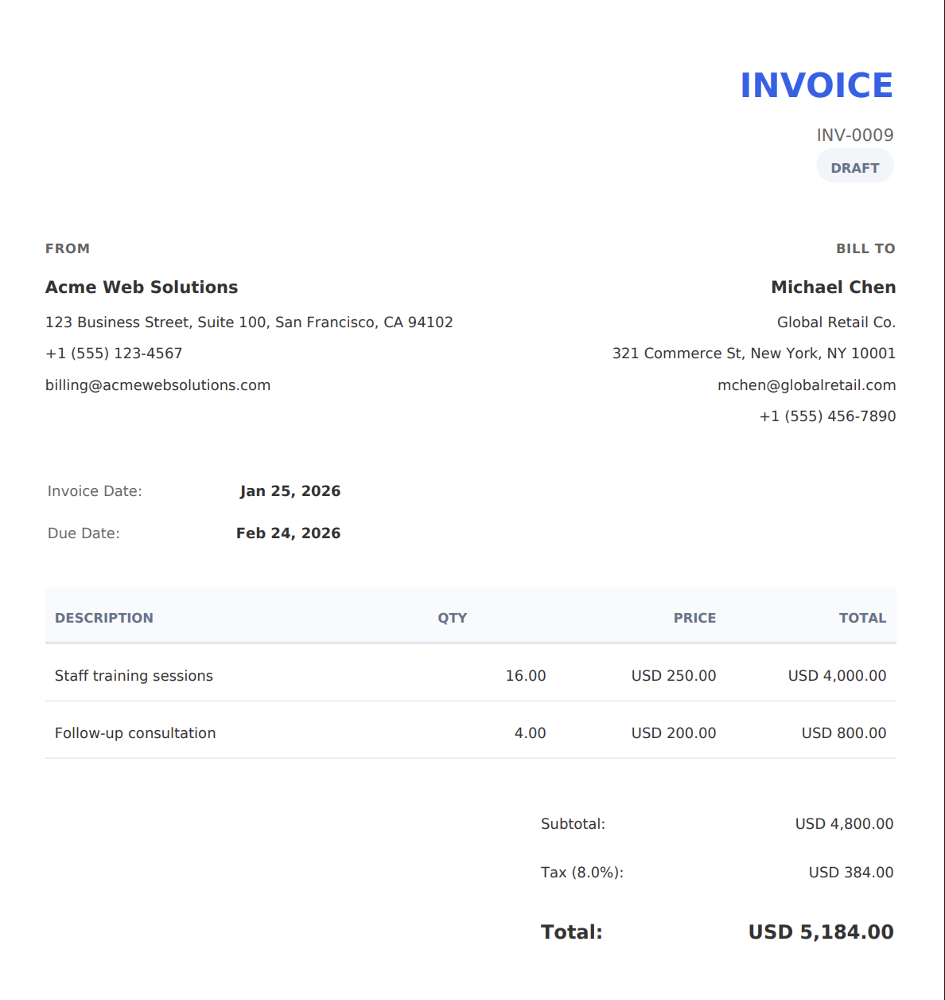

# Invoice Generator

A full-stack invoice management application built with Laravel 12 and React 18. Create professional invoices, manage clients and products, generate PDFs, and send invoices via email.


## Features

- **Authentication** - Register, login, logout, password reset with Laravel Sanctum
- **Client Management** - Full CRUD operations for managing your clients
- **Product Catalog** - Create and manage your services/products with pricing
- **Invoice Creation** - Create invoices with multiple line items
- **Auto-Calculations** - Automatic subtotal, tax, discount, and total calculations
- **PDF Generation** - Generate professional PDF invoices using DomPDF
- **Email Invoices** - Send invoices directly to clients via email
- **Dashboard** - Overview with statistics (total invoices, paid, unpaid, overdue)
- **Company Settings** - Customize your company info and upload logo
- **Status Tracking** - Track invoice status (Draft, Sent, Paid, Overdue)

## Tech Stack

### Backend
- **Framework:** Laravel 12
- **Language:** PHP 8.2+
- **Database:** PostgreSQL
- **Authentication:** Laravel Sanctum (API tokens)
- **PDF Generation:** DomPDF

### Frontend
- **Library:** React 18
- **Routing:** React Router v6
- **Styling:** Tailwind CSS 4
- **Build Tool:** Vite
- **HTTP Client:** Axios

### DevOps
- **CI/CD:** GitHub Actions
- **Testing:** PHPUnit (60 tests)

## Requirements

- PHP 8.2 or higher
- Composer 2.x
- Node.js 20 or higher
- PostgreSQL 15 or higher (or SQLite for development)

## Installation

1. **Clone the repository**
   ```bash
   git clone https://github.com/yourusername/invoice-generator.git
   cd invoice-generator
   ```

2. **Install PHP dependencies**
   ```bash
   composer install
   ```

3. **Install Node.js dependencies**
   ```bash
   npm install
   ```

4. **Configure environment**
   ```bash
   cp .env.example .env
   ```

5. **Update `.env` with your database credentials**
   ```env
   DB_CONNECTION=pgsql
   DB_HOST=127.0.0.1
   DB_PORT=5432
   DB_DATABASE=invoice_generator
   DB_USERNAME=your_username
   DB_PASSWORD=your_password
   ```

6. **Generate application key**
   ```bash
   php artisan key:generate
   ```

7. **Run database migrations and seed demo data**
   ```bash
   php artisan migrate --seed
   ```

8. **Create storage link**
   ```bash
   php artisan storage:link
   ```

9. **Start development servers**
   ```bash
   # Terminal 1 - Laravel
   php artisan serve

   # Terminal 2 - Vite
   npm run dev
   ```

10. **Visit** `http://localhost:8000`

## Demo Credentials

After running the seeder, you can log in with:

| Email | Password |
|-------|----------|
| demo@example.com | password |

The demo account includes sample clients, products, and invoices to explore the application.

## API Documentation

Full API documentation is available at [docs/API.md](docs/API.md).

### Quick Reference

| Endpoint | Method | Description |
|----------|--------|-------------|
| `/api/auth/register` | POST | Register new user |
| `/api/auth/login` | POST | Login and get token |
| `/api/clients` | GET, POST | List/Create clients |
| `/api/products` | GET, POST | List/Create products |
| `/api/invoices` | GET, POST | List/Create invoices |
| `/api/invoices/{id}/pdf-url` | GET | Get PDF download URL |
| `/api/dashboard` | GET | Get dashboard stats |

## Project Structure

```
invoice-generator/
├── app/
│   ├── Enums/              # InvoiceStatus, ProductUnit
│   ├── Http/
│   │   ├── Controllers/Api/  # API Controllers
│   │   ├── Requests/         # Form validation
│   │   └── Resources/        # API Resources
│   ├── Mail/               # Email classes
│   ├── Models/             # Eloquent models
│   ├── Policies/           # Authorization policies
│   └── Services/           # Business logic
├── database/
│   ├── factories/          # Model factories
│   ├── migrations/         # Database migrations
│   └── seeders/            # Database seeders
├── resources/
│   ├── js/
│   │   ├── api/            # API client modules
│   │   ├── components/     # React components
│   │   ├── context/        # React context
│   │   ├── pages/          # Page components
│   │   └── utils/          # Utility functions
│   └── views/
│       ├── emails/         # Email templates
│       └── pdf/            # PDF templates
├── routes/
│   └── api.php             # API routes
└── tests/
    ├── Feature/            # Feature tests
    └── Unit/               # Unit tests
```

## Testing

Run the test suite:

```bash
# Run all tests
php artisan test

# Run with coverage
php artisan test --coverage

# Run specific test file
php artisan test tests/Feature/InvoiceTest.php
```

**Test Coverage:**
- 60 tests
- 179 assertions
- Feature tests for all API endpoints
- Unit tests for business logic

## Screenshots

### Dashboard


### Clients Management


### Invoice List


### Create Invoice


### Invoice View


### Invoice PDF


## Contributing

1. Fork the repository
2. Create your feature branch (`git checkout -b feature/amazing-feature`)
3. Commit your changes (`git commit -m 'Add some amazing feature'`)
4. Push to the branch (`git push origin feature/amazing-feature`)
5. Open a Pull Request

## License

This project is open-sourced software licensed under the [MIT license](LICENSE).

## Acknowledgments

- [Laravel](https://laravel.com) - The PHP framework
- [React](https://react.dev) - The JavaScript library
- [Tailwind CSS](https://tailwindcss.com) - The CSS framework
- [DomPDF](https://github.com/barryvdh/laravel-dompdf) - PDF generation
